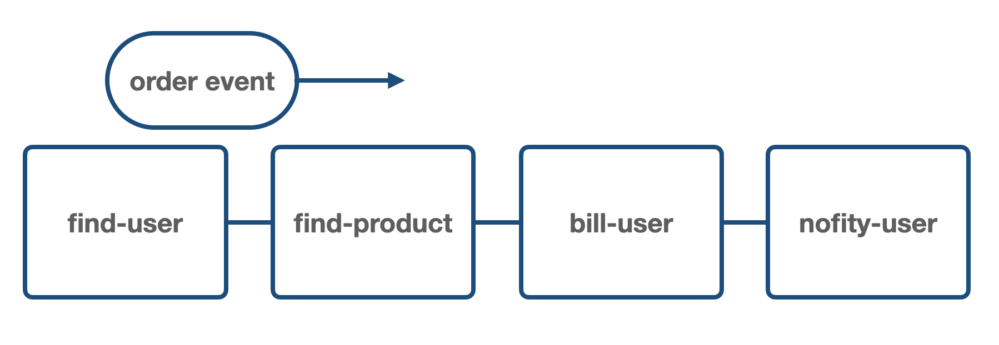
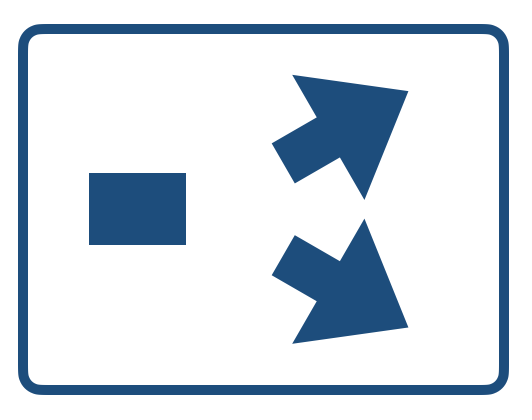
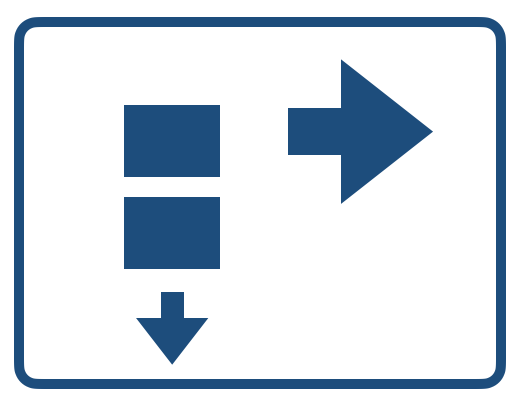
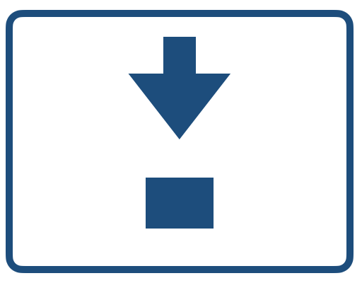
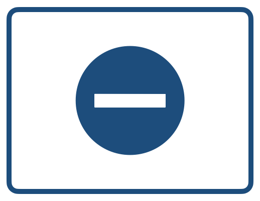
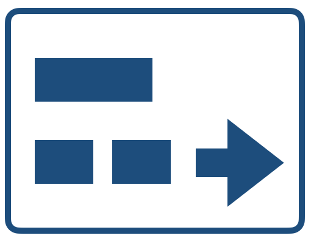
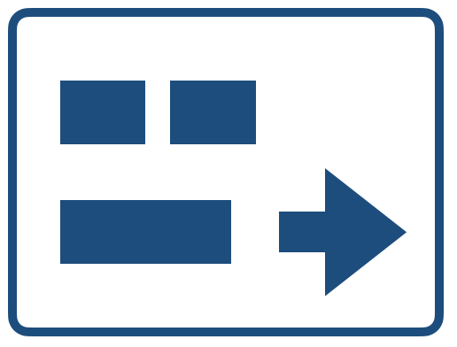
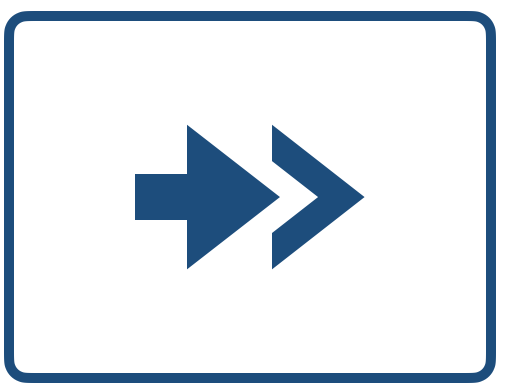
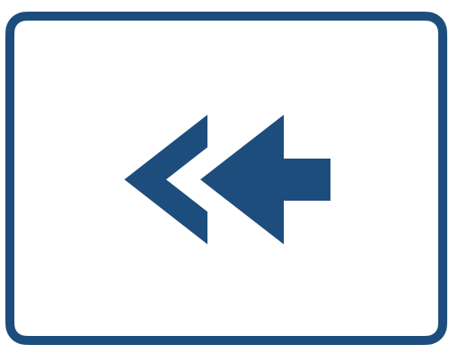

# Kraken


**Flow-based Service Orchestration Framework**

Kraken is a general framework for the orchestration of software systems.

It suggests the flow-based programming approach for organizing the interaction between the parts of the system (specific services).
It means that every interaction with the system is presented as an “input event” - the data structure that contains all the necessary information about the interaction.
The event then goes through a predefined chain of “components” (“pipelines”), the components call underlying services and modify the event.
The final state of the event represents the result of the interaction.

Kraken provides a simple declarative JSON DSL for the pipeline definitions as well as for the definitions of the “clients” to underlying services.

When thinking about layered architecture (infrastructure, domain, application, and interface layer), Kraken is like Kubernetes for the application layer of the system.
While K8s provides a declarative approach for defining the infrastructure layer (the one below the domain layer), Kraken does the same for the application layer of the system (orchestration layer).

In terms of the building blocks for the pipelines, Kraken has the same set of components as the [ALF framework](https://github.com/antonmi/ALF). 

Kraken depends on ALF and under the hood the JSON-DSL definitions are being compiled into the ALF pipelines modules. Read the [ALF Readme](https://github.com/antonmi/ALF/blob/main/README.md) to understand how it works on the Elixir level.

In terms of “clients”, Kraken uses the [Octopus](https://github.com/antonmi/octopus) library, which uses the simple “prepare-call-transform” approach for communication with external services. See the Octopus Readme for more details.

## Simple example to get the idea
The GitHub service accessible via JSON API will be used for the artificial example.

The pipeline has to return a chain of followers for the given search query.
- Input: search “query” and “limit”.
- First, return the information about the first found user.
- Then get followers of the user.
- Select the follower whose username is closest to the current username (Levenshtein distance).
- Return the information about the “closest” follower.
- Set the current username to the “closest” follower, and repeat from the “get followers" step.
- Return not more than “limit” results.

For example, for query="antonmi", and limit=5, the chain of the usernames might be:
```text
antonmi -> antouanbg -> guangyuzhang -> gamemann -> damaru
```

The full code can be found [here](https://github.com/antonmi/kraken_examples/tree/main/apps/github)

### Services definition
The service definition for the GitHub API is:
```json
{
  "name": "github",
  "client": {
    "module": "OctopusClientHttpFinch",
    "start": {
      "base_url": "https://api.github.com",
      "headers": {
        "Accept": "application/vnd.github+json"
      }
    }
  },
  "interface": {
    "find_users": {
      "prepare": {
        "method": "GET",
        "path": "/search/users",
        "params": {
          "q": "args['query']",
          "per_page": "args['per_page']"
        }
      },
      "call": {"parse_json_body": true},
      "transform": {
        "usernames": "get_in(args, ['body', 'items', Access.all(), 'login'])"
      }
    },
    "get_user": {
      "prepare": {
        "method": "GET",
        "path": "'/users/' <> args['username']"
      },
      "call": {"parse_json_body": true},
      "transform": {
        "username": "get_in(args, ['body', 'login'])",
        "name": "get_in(args, ['body', 'name'])",
        "company": "get_in(args, ['body', 'company'])",
        "location": "get_in(args, ['body', 'location'])",
        "followers": "get_in(args, ['body', 'followers'])"
      }
    },
    "get_followers": {
      "prepare": {
        "method": "GET",
        "path": "'users/' <> args['username'] <> '/followers'",
        "params": {
          "page": "args['page']",
          "per_page": "args['per_page']"
        }
      },
      "call": {"parse_json_body": true},
      "transform": {
        "followers": "get_in(args, ['body', Access.all(), 'login'])"
      }
    }
  }
}
```
The "client" section defines the transport-level module for HTTP communication - "OctopusClientHttpFinch".
It's a very simple [library](https://hex.pm/packages/octopus_client_http_finch) built on top of the Elixir Finch HTTP client.

The interface section defines three functions: "find_users", "get_user", "get_followers". Each function takes a JSON object as input.

The "prepare" step prepares data for the call.

The "call" step can have some additional options that will be passed to the low-level client (e.g. {"parse_json_body": true})

And the "transform" step finally gets the necessary data from the API response.

One may see a bit of Elixir code here. Only simple "access" functions are available.
Also, it is possible to define custom helpers for more complex data extraction.
See the [Octopus](https://github.com/antonmi/octopus) page and code.

There will be also one lambda-like service for the calculation of the Levenshtein distance.
Octopus (and Kraken) allows one to define a service from an Elixir module.
Here is the JSON definition:
```json
{
  "name": "levenshtein",
  "client": {
    "module": "octopus.elixir-module-client",
    "start": {
      "code": [
        "defmodule Distance do",
        "def closest(%{\"name\" => name, \"names\" => names}) do",
        "closest = Enum.min_by(names, &Levenshtein.distance(&1, name))",
        "%{\"closest\" => closest}",
        "end",
        "end"
      ]
    }
  },
  "interface": {
    "closest": {
      "input": {
        "name": {"type": "string"},
        "names": {"type": "array"}
      },
      "call": {
        "module": "Distance",
        "function": "closest"
      },
      "output": {
        "closest": {"type": "string"}
      }
    }
  }
}
```
One can see the "code" in the definition.
There are no "prepare" and "transform" steps, since the "closest" function already accepts the JSON-like Elixir map, and returns a similar data structure. 

Also, there are "input" and "output" in the interface definition. These are optional steps for data validations.
Octopus uses the [ex_json_schema](https://github.com/jonasschmidt/ex_json_schema) library for optional validations of input and output.

That's it. After submitting these definitions to the Kraken-based agent, and starting the services, 
```text
POST /services/define github-definition
POST /services/define levenshtein-definition
POST /services/start/github
POST /services/start/levenshtein
```
one call services like:
```text
POST /services/call/github/find_users {"query": "antonmi"}
POST /services/call/levenshtein/closest {"name": "anton", "names": ["bread", "baton", "salat"]}
```

### Pipeline definition
The ALF flow diagram for the solution might be:


The pipeline definition is:
```json
{
  "name": "stream-similar-followers",
  "components": [
    {
      "type": "stage",
      "name": "init",
      "transform": {"counter": 0, "limit": "args['limit'] || 10"}
    },
    {
      "type": "stage",
      "name": "search",
      "service": {"name": "github", "function": "find_users"},
      "prepare": {"query":  "args['query']", "per_page": 1},
      "transform": {"username":  "get_in(args, ['usernames', Access.at(0)])"}
    },
    {
      "type": "goto-point",
      "name": "repeat"
    },
    {
      "type": "stage",
      "name": "get-user",
      "service": {"name": "github", "function": "get_user"},
      "prepare": {"username":  "args['username']"},
      "transform": {"user_data":  "args"}
    },
    {
      "type": "stage",
      "name": "inc-counter",
      "transform": {"counter":  "args['counter'] + 1"}
    },
    {
      "type": "clone",
      "name": "clone",
      "to": [
        {
          "type": "stage",
          "name": "get-followers",
          "service": {"name": "github", "function": "get_followers"},
          "prepare": {"username":  "args['username']"},
          "transform": {"followers":  "args['followers']"}
        },
        {
          "type": "switch",
          "prepare": {
            "count": "length(args['followers'])",
            "counter": "args['counter']",
            "limit": "args['limit']"
          },
          "condition": "if args['count'] > 0 && args['counter'] < args['limit'], do: \"branch1\", else: \"branch2\"",
          "branches": {
            "branch1": [
              {
                "type": "stage",
                "name": "find-closest",
                "service": {"name": "levenshtein", "function": "closest"},
                "prepare": {"name":  "args['username']", "names":  "args['followers']"},
                "transform": {"closest":  "args['closest']"}
              },
              {
                "type": "stage",
                "name": "reassign-vars",
                "transform": {"username": "args['closest']", "followers": "hidden"}
              },
              {
                "type": "goto",
                "to": "repeat",
                "condition": "true"
              }
            ],
            "branch2": [{"type": "dead-end"}]
          }
        }
      ]
    }
  ]
}
```
One can see several components here:
- "stage" - for calling of underlying services.
- "switch", "clone", "goto" for directing the "event".

Stages have the "prepare", "service", and "transform" sections.
For example the "get-user" component:
```json
{
  "type": "stage",
  "name": "get-user",
  "prepare": {"username":  "args['username']"},
  "service": {"name": "github", "function": "get_user"},
  "transform": {"user_data":  "args"}
}
```
It first gets 'username' from the event, then call the "get_user" function on the "github" service, 
and finally updates the event puts the event by setting 'user_data'. 

There are also stages that just "transform" the event - "inc-counter" and "reassign-vars".

After posting the definition to the Kraken agent, magic happens, and the ALF pipeline appears in the agent code. 
```text
POST /pipelines/define pipeline-definition
POST /pipelines/start/stream-similar-followers
```
Then one can post events to the pipeline and get the results back:
```text
POST /pipelines/call/stream-similar-followers  {"query": "antonmi", "limit": 5}
or
POST /pipelines/stream/stream-similar-followers  {"query": "antonmi", "limit": 5}
to stream the output events 
```

## More realistic cases
Let's say you have an online shop system.

There might be "user-service", "products-service", "billing-service", and "notification-service" services.

There might be a dozen of "flows", or "business-flow", or "user-flows", or "use-cases", that are "pipelines" in Kraken (ALF) terminology:
- User registration
- User login
- User lists products
- User orders products
- etc. and etc.

Each service is deployed to the system and exposes its API.

Now, the job of the "application engineer" is to design and build these flows in the system.

For each "use-case", one should: 
- define the "services" - uniform mapping to the underlying services API.
- define the "event" that represents the interaction (and its result).
- define the "pipeline" - a chain of components that will transform the event accordingly to the business logic.

For example, for the "User orders products", the "event" representing the interaction would be:
```json
{
  "type": "user-orders-a-product",
  "user_id": "user-123",
  "product_id": "product-456", 
}
```

The corresponding pipeline (simplified):

```json
{
  "name": "user-orders-a-product",
  "components": 
    [
      {
          "name": "find-user",
          "service": {"name": "user-service", "function": "find"}
      },
      {
          "name": "find-product",
          "service": {"name": "product-service", "function": "find"}
      },
      {
          "name": "bill-user",
          "service": {"name": "billing-service", "function": "bill"}
      },
      {
          "name": "notify-user",
          "service": {"name": "notification-service", "function": "send-email"}
      }
    ]
}
```
So, the event goes through four components, each component calls underlying services.
After all the transformations, the output would be like:
```json
{
  "type": "user-orders-a-product",
  "success": "yes",
  "order_id": "789", 
}
```

After the definitions are ready, one can simply push them to the Kraken-based agent that is deployed to the system.

It's just a new instance (pod) in the system that will coordinate all the underlying services.

## Philosophy. Or why is it cool?
### Flow-based programming
The approach applies the great engineering idea of an assembly line.
An initial workpiece is placed on the conveyor and goes through several processing stages until it becomes a ready-to-use product.

This flow-based programming is a case of the general "event-driven" approach, where business logic is triggered by data.
The main distinction are:
- The topology of the "flow" is defined explicitly.    
- A single event represents the result of the interaction with the particular use-case in the software system.

This provides extraordinary observability and there understandability of the defined logic:
- One can simply see and read "pipelines" (both in code and diagrams).
- One can "sit" on an event and easily track its changes when passing through components in a pipeline.
- One can "sit" on a component and observe transformations of different events passing through it.

### Elixir GenStages, scaling, and monitoring
Under the hood, the ALF runs all components' code inside Elixir GenServers. It means that all the components work in parallel. 
When one pushes the stream of events to the pipeline, one component works with an n-th event, and the previous one work on (n-1)-th.

Also, ALF (and therefore Kraken) allows having several copies of a component, which adds additional (and configurable) horizontal parallelism.

ALF uses the Elixir/Erlang [telemetry](https://github.com/beam-telemetry/telemetry) library, so it's easy to track the event transformation on each step.

See the [ALF-monitor](https://github.com/antonmi/alf_monitor) project and video there.

### Declarative JSON DSL
What can be simpler than JSON?

Kraken uses it for services and pipelines definitions, and events are also just JSON objects.

So, Kraken provides a very simple DLS for modeling the whole application (orchestration) layer for a software system.

Moreover, services definitions can be considered as a specification for the underlying service:
- services "names" and "interface functions" (together with input/output specifications) define a "language" for communicating with underlying domain services.
- the "specifications" can (even must) be used by the engineers that work with domain-level services.

The pipeline definitions are comprehensible data structures that are consistent with visual representations of the flows defined using ALF diagrams.

The "design-, code-, and runtime-uniformity" buzz-phrase can be used for describing the advantages of the approach:
- when one designs a "pipeline", he/she thinks in terms of a chain of components and draws it on paper using the diagram language.
- when one codes the pipeline, he/she codes the same structure as was on the paper.
- and finally, when the program runs, it passes events throw the same chain of components.

### Kraken-agent
One can for sure compile all the definitions in a build time and then upload the "orchestrator" into the system.

However, I see more advantages when the code is uploaded dynamically. So, first one uploads "an empty" Kraken-based orchestrator, then uploads all the definitions and starts the pipelines.

It is similar to the Kubernetes approach to creating an infrastructure layer of the system.

The code then resides separately from the "orchestrator" and can be uploaded using a "client", something like `kraken apply .` (similar to `kubectl apply .`).

It will allow one to dynamically add new services and pipelines (or new versions of them).

It also opens huge opportunities for developing (prototyping) pipelines on existing systems (better its development-purpose copies).

And also an IDE-like client can be implemented, providing a low-code platform for the orchestration layer.  


## More technical details are below

### Components
See [ALF components overview](https://github.com/antonmi/ALF#components-overview) for more details.

| image                                                                           | type       | required                                     |
|---------------------------------------------------------------------------------|------------|----------------------------------------------|
|                                         | stage      | it can be empty or have only "transform" section |
|                                        | switch     | "condition" - code, and "branches" - list of components | 
|                                         | clone      | "to" - a list of components                  |
|                                          | goto       | "to" - the name of the "goto-point", "condition": code |
|                                    | goto-point | "name" - the "goto" refers to the name       |
|                                      | dead-end   | nothing                                      |
|                                    | decomposer | "service", "decompose" with "event" and "events" |
|                                    | recomposer | "service", "decompose" with "event" and "events" |
|   | plug       | "pipeline"                                    |


### API

See [router.ex](lib/kraken/api/router.ex)

#### Services
```text
POST /services/define
GET /services
GET /services/status/:name
GET /services/definition/:name
GET /services/state/:name  
POST /services/start/:name
POST /services/stop/:name 
POST /services/delete/:name 
POST /services/call/:name/:function 
```
#### Pipelines
```text
POST /pipelines/define 
GET /pipelines 
GET /pipelines/status/:name 
GET /pipelines/definition/:name
POST /pipelines/start/:name
POST /pipelines/stop/:name 
POST /pipelines/delete/:name 
POST /pipelines/call/:name 
POST /pipelines/cast/:name 
POST /pipelines/stream/:name 
```
#### Routes
```text
POST /routes/define
GET /routes
```
#### Events
```text
POST /call
POST /cast
POST /stream
```
